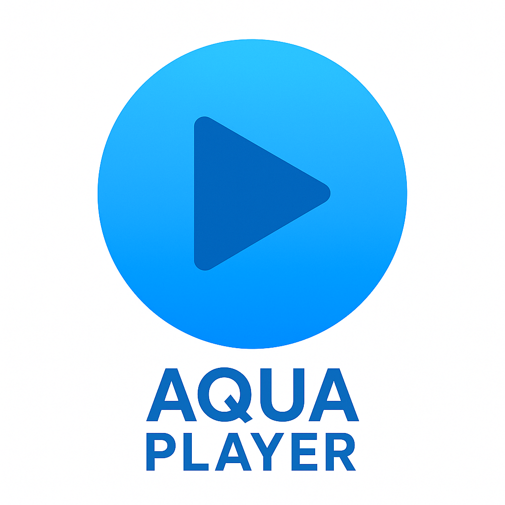

# Aqua Player

An opinionated, modern video player for desktop. It reflects a strong vision: informative yet simple, beautiful UI with rich, practical functionality. Inspired by Soda Player.

Aqua Player also serves as a clear example of how to build a polished video player with Electron, React, and electron-forge (Webpack based).

## Highlights

- Clean, focused UI that gets out of your way
- Open via drag-n-drop, file association, cli or builtin
- Tracks watched file
- Instant file open dialog with smart filters for video/audio
- Automatic playlist from the file’s folder (next/previous)
- Keyboard shortcuts with an in-app reference dialog (Press ? to open keymap guide)
- Windows taskbar progress integration
- Optional auto-update (opt-out on first run)

## Inspiration

Aqua Player takes cues from Soda Player: opinionated defaults, minimal surface area, and power features that feel effortless.

## Roadmap

- HTTP streaming support
- MPV integration for advanced audio decoding (e.g., 5.1)
- Multiple subtitle tracks display
- AirPlay on Windows

If you have ideas or feedback, please open an issue.

## Development

- Requirements: Node 18+, pnpm
- Start in dev: `pnpm install` then `pnpm start`
- Build installers: `pnpm make`
- CI: GitHub Actions builds for Windows/macOS and publishes release artifacts
